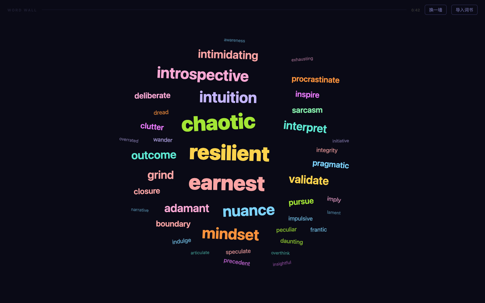

# Word Wall

A vocabulary learning app that feels like popping bubble wrap — not grinding through flashcards.

**Live → [demianman.github.io/word-wall](https://demianman.github.io/word-wall/)**



---

## The idea

Most vocab apps present words one at a time, like a queue you have to process. The goal here was lower activation energy: open the page, the whole wall is already there, pop words whenever one catches your eye.

The interaction mirrors bubble wrap — the whole sheet is visible at once, you work in any order, and each pop gives a small hit of completion.

---

## Word list

**~190 words** curated from the **COCA (Corpus of Contemporary American English)** frequency list, focusing on the 2000–5000 band — words that appear constantly in everyday spoken English, articles, and podcasts, but that intermediate learners often haven't fully internalized.

The list skews toward:
- Emotional and psychological vocabulary (anxiety, burnout, spiral, validate)
- Personality and social dynamics (candid, cynical, assertive, condescending)
- Everyday verbs you reach for mid-sentence (procrastinate, ramble, fluctuate, undermine)
- Abstract nouns that appear in conversation (nuance, momentum, precedent, facade)

Each entry includes a manually written American English IPA transcription and a contextual example sentence with the target word highlighted.

---

## Learning algorithm

Words have three states, tracked in `localStorage`:

| State | Meaning |
|-------|---------|
| **new** | Not yet encountered |
| **review** | Appeared on a wall but left unpopped |
| **known** | Popped at least once |

**Wall composition** on each load:
1. Up to 14 **review** words — words you've left behind before (marked with a warm orange glow)
2. **New** words fill the remaining slots
3. If the pool runs out, **known** words appear as light reinforcement

**Review words never disappear** — if you skip a word, it comes back next wall with priority. Once you pop it, it's marked known. Known words don't regress to review even if you skip them on a reinforcement appearance.

Progress persists across sessions. The done screen shows cumulative stats: known / review / total.

---

## Interaction

| Action | Result |
|--------|--------|
| Click a word | Opens a card: IPA · definition · example sentence |
| `Space` or click "认识 ✓" | Pops the word — particle burst, marked known |
| `Esc` or "跳过" | Closes card, word stays on wall |
| Click "换一墙" | Records unpopped words as review, loads a new wall |
| All words popped | Done screen with session stats |

**Review words** are shown with a subtle amber glow so you can spot them at a glance.

---

## Custom word import

Top-right "导入词书" button accepts four formats, auto-detected:

| Format | Structure |
|--------|-----------|
| `.txt` | One word per line |
| `.csv` | Header row: `word, meaning, phonetic, pos, example` |
| `.tsv` | Tab-separated — Anki export compatible |
| `.json` | `[{ "word": "", "meaning": "", "phonetic": "", "pos": "", "example": "" }]` |

A template CSV is available via the "下载模板 CSV" button. Imported lists persist in `localStorage`.

---

## Tech

Single self-contained HTML file. No dependencies, no build step, no backend. Works offline after first load.

- **Layout**: absolute positioning + Archimedean spiral placement with AABB collision detection
- **Sizing**: six font tiers (13–62px) distributed across ~42 words per wall
- **Audio**: Web Speech API for pronunciation (voice priority: Samantha → Ava Enhanced → any `en-US` local voice) + Web Audio API for pop sound effect
- **Persistence**: `localStorage` for custom word lists and per-word progress
- **Hosting**: GitHub Pages

---

## Run locally

```bash
open index.html   # macOS
```

No server needed.
